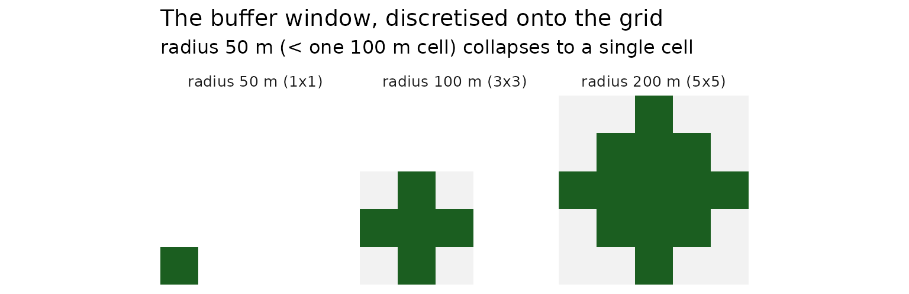
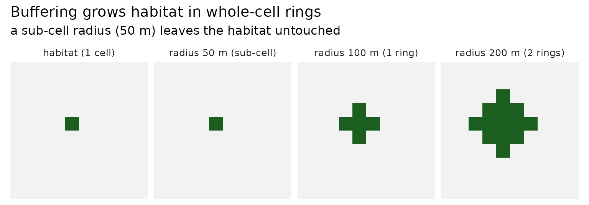
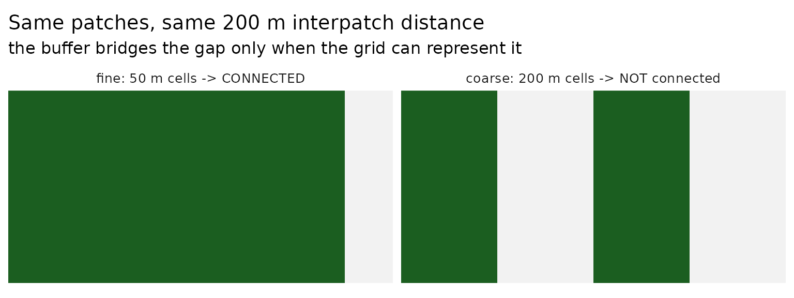

# Interpatch distance and raster resolution

``` r

library(urbioconnect)
library(terra)
library(ggplot2)
```

This vignette explores a small but important detail when using raster
data to analyse connectivity: the relationship between the interpatch
distance and the raster resolution.

This boils down to a key idea: if your buffer distance is not a multiple
of your raster resolution, you might not be buffering as you might
expect. Essentially:

**Your buffer radius must be at least one cell**, i.e.

``` math
\text{resolution} \le \frac{\text{interpatch distance}}{2}.
```

This vignette goes into a bit more detail on the topic.

## Interpatch distance

When you analyse connectivity you specify an **interpatch distance**:

> the distance between two habitat patches below which they count as
> connected.

If a species can disperse across a 200 m gap, its interpatch distance is
200 m.

Internally, connectivity is computed by *buffering* the habitat -
growing each patch outward - and seeing which patches then overlap.
Because **both** patches grow toward each other, they meet when the gap
between them is twice the buffer radius. So the buffer radius is
**half** the interpatch distance:

``` math
\text{buffer radius} = \frac{\text{interpatch distance}}{2}
```

[`habitat_connectivity()`](https://urbio-ecology.github.io/urbioconnect/reference/habitat_connectivity.md)
takes the interpatch distance and halves it for you. The lower-level
[`habitat_buffer()`](https://urbio-ecology.github.io/urbioconnect/reference/habitat_buffer.md)
is an operation and takes the `buffer_radius` directly.

## Buffering happens on a grid

When habitat is stored as a raster, a grid of square cells.
[`habitat_buffer()`](https://urbio-ecology.github.io/urbioconnect/reference/habitat_buffer.md)
uses a circular focal window of the requested radius, but that circle
has to be **discretised** onto the grid.

The number of whole-cell “rings” it can add is
`floor(buffer_radius / resolution)`:

``` r

# 100 m cells
r <- rast(
  nrows = 10,
  ncols = 10,
  extent = ext(0, 1000, 0, 1000)
)
sapply(
  c(50, 100, 150, 200),
  function(d) {
    circle_buffer <- focalMat(r, d = d, type = "circle")
    circle_buffer_dim <- dim(circle_buffer)
    paste(circle_buffer_dim, collapse = "x")
  }
)
#> [1] "1x1" "3x3" "3x3" "5x5"
```

A radius of 100 m (one cell) gives a 3×3 window - one ring. A radius of
**50 m is smaller than a single 100 m cell**, so the window collapses to
1×1: there is nowhere to grow, and no buffer is possible. A radius of
150m still only gives one ring - it snaps down to 100m.



## A sub-cell radius does nothing - and `habitat_buffer()` warns

Because the window collapses, buffering by less than one cell leaves the
habitat exactly as it was.
[`habitat_buffer()`](https://urbio-ecology.github.io/urbioconnect/reference/habitat_buffer.md)
detects this and warns you, then returns the habitat unchanged (rather
than letting
[`terra::focal()`](https://rspatial.github.io/terra/reference/focal.html)
error):

``` r

hab <- r
values(hab) <- NA
# one habitat cell
hab[5, 5] <- 1 

# sub-cell: warns, no-op
b50 <- habitat_buffer(hab, buffer_radius = 50) 
#> Warning: Can't represent the buffer at a resolution of 100m.
#> ✖ Buffer radius (50m) is smaller than one raster cell.
#> ℹ This radius corresponds to an `interpatch_distance` of 100m.
#> ℹ Gaps between patches aren't bridged; only touching patches are linked.
#> ℹ Rule of thumb: keep resolution <= interpatch_distance / 2 (use finer cells,
#>   or a larger interpatch distance).
#> ℹ See `vignette(urbioconnect::interpatch-distance-and-resolution)`.
# one ring
b100 <- habitat_buffer(hab, buffer_radius = 100) 
# two rings
b200 <- habitat_buffer(hab, buffer_radius = 200) 
```



## Why it matters: the same distance, two resolutions

This is the crux. Connectivity is **resolution-dependent**. Two patches
with a 200m gap need a 100 m buffer each to link. At a fine resolution
that buffer is representable and the patches connect; at a coarse
resolution the same 100 m buffer is sub-cell - a no-op - and the patches
stay apart, even though the interpatch distance hasn’t changed.



## Choosing a resolution

The practical rule of thumb: **your buffer radius must be at least one
cell**, i.e.

``` math
\text{resolution} \le \frac{\text{interpatch distance}}{2}.
```

For an interpatch distance of 200 m, work at 100 m cells or finer. If
the resolution is too coarse for the interpatch distance you’ve asked
for,
[`habitat_buffer()`](https://urbio-ecology.github.io/urbioconnect/reference/habitat_buffer.md)
(and therefore
[`habitat_connectivity()`](https://urbio-ecology.github.io/urbioconnect/reference/habitat_connectivity.md))
will warn that the buffer can’t be represented - increase the
resolution, or use a larger interpatch distance.

## What about vector (sf) data?

Everything above is specific to **raster** data. The vector path
([`sf_habitat_buffer()`](https://urbio-ecology.github.io/urbioconnect/reference/sf_habitat_buffer.md),
via
[`sf::st_buffer()`](https://r-spatial.github.io/sf/reference/geos_unary.html))
buffers in *continuous* coordinate space - there is no grid and no
resolution, so **any** buffer radius produces an exact buffer. The
sub-cell “no buffer” problem simply does not arise, which makes the
vector approach a good fit when your interpatch distance is small
relative to a practical raster resolution.

The vector equivalent of discretisation is `nQuadSegs`: the number of
straight segments used to approximate each quarter-circle of the buffer.
It controls the *smoothness* of the buffer outline, not whether the
buffer exists. The package uses `nQuadSegs = 5` (a 20-sided polygon),
which sits slightly *inside* the true circle - enough to matter only for
patches whose gap is right at the threshold. Unlike resolution, it is
never a cliff: the buffer always forms, at any radius.
