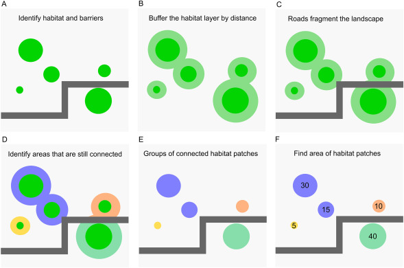

```{r}
#| include: false
knitr::opts_chunk$set(
  collapse = TRUE,
  comment = "#>",
  fig.align = "center",
  fig.width = 5,
  fig.height = 5
)
```

```{r}
#| label: setup
library(urbioconnect)
library(terra)
```

## Overview

`urbioconnect` implements the habitat connectivity method described in Kirk et al. (2023):

> Kirk, H., Soanes, K., Amati, M., Bekessy, S., Harrison, L., Parris, K., Ramalho, C., van de Ree, R., & Threlfall, C. (2023). Ecological connectivity as a planning tool for the conservation of wildlife in cities. *MethodsX*, 10, 101989. <https://doi.org/10.1016/j.mex.2022.101989>

The core idea is two habitat patches are considered connected if an animal can travel between them without crossing a barrier (e.g., a road). We buffer the habitat by a species-specific **interpatch distance**, then cut those buffers wherever barriers exist. The remaining pieces of habitat that are connected become **patches**, and we summarise their areas to compute connectivity metrics. This workflow is represented visually in the figure below, from the paper by Kirk et al.:

```{r}
#| label: "Effective-mesh-demonstration"
#| echo: false

```

This vignette walks through the raster workflow step by step using the built-in Blue-tongued Lizard example data from Darebin Creek, Melbourne. We then show how to run the same workflow in a single function call.

## The example data

The package ships with habitat and barrier rasters for a Blue-tongued Lizard study area along Darebin Creek, between Preston and West Heidelberg, Melbourne. 

```{r}
#| label: load-data
habitat <- example_habitat()
barrier <- example_barrier()

habitat
barrier
```

The habitat raster has value 1 where lizard habitat exists, NA elsewhere. 

```{r}
#| label: plot-habitat
plot(habitat, main = "Lizard Habitat", col = "seagreen", legend = FALSE)
```

The barrier raster has value 1 where barriers (roads exist), 0 elsewhere.

```{r}
#| label: plot-barrier
plot(barrier, main = "Lizard Barriers", col = c("white", "black"), legend = FALSE)
```

We can see these overlaid:

```{r}
#| label: plot-habitat-barrier
plot(barrier, main = "Lizard Habitat and Barrier", col = c("white", "black"), legend = FALSE)
plot(habitat, col = "seagreen", add = TRUE, legend = FALSE)
```

The dispersal distance for the blue-tongued lizard in this environment is normally 1,000m, which suggess a interpatch_distance of 500 m -- half the connectivity threshold. This means two patches are considered connected if the outside most edges are within 500 metres of each other. 

While 500m is most accurate, the examples below use a smaller interpatch distance to increase computational speed.

## The pipeline, step-by-step

Let's now break down each step in the pipeline:

1. Create barrier mask
2. Remove habitat under barriers
3. Buffer the habitat
4. Fragment habitat along barriers
5. Assign patch IDs
6. Summarise patch areas

### Step 1: Create the barrier mask

`create_barrier_mask()` converts the barrier raster (1 = barrier, NA = passable) into a multiplier mask (NA = barrier, 1 = passable). This format lets us block movement when we multiplying layers together.

```{r}
#| label: barrier-mask
barrier_mask <- create_barrier_mask(barrier)
plot(barrier_mask, col = c("grey"), legend = FALSE)
```

### Step 2: Remove habitat under barriers

Habitat sitting directly beneath a barrier is removed before analysis. Roads bisecting a habitat patch effectively remove the habitat for connectivity purposes. We can see here below where the habitats have been removed - the green spaces are habitat kep, and the orange ones are habitat that intersected with barriers.

```{r}
#| label: drop-under-barrier
remaining_habitat <- drop_habitat_under_barrier(
  habitat = habitat,
  barrier_mask = barrier_mask
)
```


```{r}
#| label: plot-drop-under-barrier
plot(barrier_mask, col = c("grey"), legend = FALSE)
plot(habitat, col = "#d95f02", legend = FALSE, add = TRUE)
plot(remaining_habitat, col = "#1b9e77", legend = FALSE, add = TRUE)
```

### Step 3: Buffer the habitat

`habitat_buffer()` expands the habitat outward using a circular focal window. This is the spatial operation of buffering, which we use to represent the interpatch distance - here the **interpatch_distance** should be *half* the species' connectivity threshold. For example, if two patches are considered connected when within 200 m of each other, use a 100 m buffer, as the buffers overlap when patches are within 200 m. For the blue-tongued lizard in urban Melbourne, the median dispersal distance is 1000 m (Kirk et al., 2023), so we would use a buffer of 500 m. However, we use 10 for a faster demonstration on the small example dataset.

```{r}
#| label: interpatch
interpatch_distance <- 10

buffered_habitat <- habitat_buffer(
  habitat = remaining_habitat,
  interpatch_distance = interpatch_distance
)

plot(barrier_mask, col = scales::alpha("grey", 1), legend = FALSE)
plot(buffered_habitat, col = "darkgreen", legend = FALSE, add = TRUE)
plot(remaining_habitat, col = "#1b9e77", legend = FALSE, add = TRUE)
```


We can now visualise the three layers together using `gg_barrier_habitat_interpatch_dist()`:

```{r}
#| label: plot-layers
#| fig-width: 6
#| fig-height: 5
gg_barrier_habitat_interpatch_dist(
  barrier = barrier,
  buffered = buffered_habitat,
  habitat = remaining_habitat,
  interpatch_distance = interpatch_distance,
  species = "Blue-tongued Lizard",
  col_barrier = "grey30",
  col_buffer = "lightgreen",
  col_habitat = "#1b9e77",
  col_paper = "white"
)
```


### Step 4: Fragment habitat along barriers

`fragment_habitat()` cuts the buffered habitat wherever a barrier cell exists. This is the step that disconnects patches separated by roads.

```{r}
#| label: fragment
fragmented <- fragment_habitat(
  buffered_habitat = buffered_habitat,
  barrier_mask = barrier_mask
)

fragmented
```

### Step 5: Assign patch IDs

`assign_patches_to_fragments()` labels each habitat cell with an integer identifying which connected patch it belongs to. Habitat cells that share a fragment blob get the same patch ID.

```{r}
#| label: patch-ids
patch_id_raster <- assign_patches_to_fragments(
  remaining_habitat = remaining_habitat,
  fragment = fragmented
) |>
  add_patch_area()

patch_id_raster
```

`add_patch_area()` appends a cell-area layer to the raster, which is needed for the area calculations in the next step.

We can plot the patches, with each connected patch shown in a distinct colour using `plot_patches()`:

```{r}
#| label: plot-patches
#| fig-width: 6
#| fig-height: 5
plot_patches(
  patch_id = patch_id_raster,
  interpatch_distance = interpatch_distance,
  species = "Blue-tongued Lizard"
)
```

### Step 6: Summarise patch areas

`aggregate_connected_patches()` collapses the raster down to one row per patch, summing the area of all habitat cells within that patch.

```{r}
#| label: aggregate
areas_connected <- aggregate_connected_patches(patch_id_raster)
areas_connected
```

The result has three columns:

- `patch_id` - integer identifier for the connected patch
- `area` - total habitat area within the patch (square metres)
- `area_squared` - squared area, used in the connectivity metrics below

## Computing connectivity metrics

`summarise_connectivity()` takes the patch area data and computes a set of landscape-level connectivity metrics:

```{r}
#| label: summarise
results <- summarise_connectivity(
  area = areas_connected$area,
  interpatch_distance = interpatch_distance,
  target_resolution = 500,
  data_resolution = 10,
  aggregation_factor = 50,
  species = "Blue-tongued Lizard"
)

results
```

The two key metrics are:

**Effective mesh size (ha)** - the average area of the patch a randomly chosen animal finds itself in. Larger values mean better connectivity:

$$m_{\text{eff}} = \frac{\sum A_i^2}{\sum A_i} \times 0.0001$$

**Probability of connectedness** - the probability that two randomly chosen points within habitat are in the same connected patch. Ranges from 0 (fully fragmented) to 1 (all habitat connected):

$$P_c = \frac{m_{\text{eff}}}{\text{total habitat area}}$$

Where $A_i$ is the area of a given patch.

## Run the pipeline as a single step

We developed each step of the pipeline as a set of functions that can be run individually. If you would like to run it all in one step, you can run `habitat_connectivity()`. Note the messages noting the step, and time taken. You can control this by setting `verbose` to FALSE if you do not want the loading/running messages.

```{r}
#| label: shortcut
areas_connected <- habitat_connectivity(
  habitat = habitat,
  barrier = barrier,
  interpatch_distance = 10,
  verbose = TRUE
)
```

The package also includes a pre-computed version of this result (at 50 m interpatch distance) as `lizard_areas_connected`:

```{r}
#| label: precomputed
lizard_areas_connected
```

If you need the intermediate rasters for mapping or reporting, use `habitat_connectivity_full()` instead. It returns a named list containing the buffered habitat, patch ID raster, barrier mask, remaining habitat, and the `areas_connected` data frame:

```{r}
#| label: full
result <- habitat_connectivity_full(
  habitat = habitat,
  barrier = barrier,
  interpatch_distance = 10,
  verbose = FALSE
)

names(result)
```

## Comparing multiple interpatch distances

A common workflow is to run the analysis at several interpatch distances and compare the results. Use `purrr::map()` to iterate, then `purrr::list_rbind()` to combine:

```{r}
#| label: multi-interpatch
#| 
distances <- c(10, 25, 50)

all_results <- purrr::map(
  distances,
  function(d) {
    areas <- habitat_connectivity(
      habitat = habitat,
      barrier = barrier,
      interpatch_distance = d,
      verbose = FALSE
    )
    summarise_connectivity(
      area = areas$area,
      interpatch_distance = d,
      target_resolution = 500,
      data_resolution = 10,
      aggregation_factor = 50,
      species = "Blue-tongued Lizard"
    )
  }
) |>
  purrr::list_rbind()

all_results
```

With multiple buffer distances you can visualise how connectivity changes using `plot_connectivity()`:

```{r}
#| label: plot-connectivity
#| eval: true
plot_connectivity(all_results)
```

`plot_connectivity()` produces a faceted ggplot2 figure showing each connectivity metric (number of patches, probability of connectedness, mean patch area, total habitat area) as a function of interpatch distance.

## Summary

The core raster workflow in `urbioconnect` is:

1. `create_barrier_mask()` - invert the barrier raster into a passability mask
2. `drop_habitat_under_barrier()` - remove habitat beneath barriers
3. `habitat_buffer()` - expand habitat by the interpatch distance (half the connectivity threshold)
4. `fragment_habitat()` - cut the buffer where barriers exist
5. `assign_patches_to_fragments()` + `add_patch_area()` - label and measure connected patches
6. `aggregate_connected_patches()` - summarise patch areas
7. `summarise_connectivity()` - compute effective mesh size and probability of connectedness

Or, equivalently, use `habitat_connectivity()` for the data frame output, or `habitat_connectivity_full()` when you also need the intermediate rasters.
